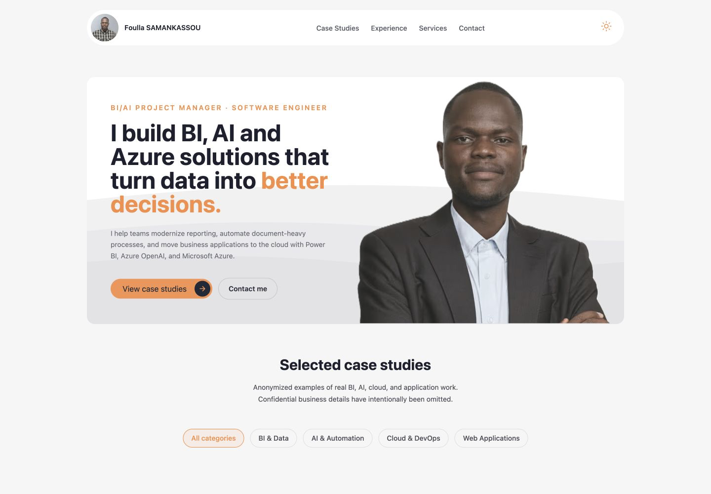
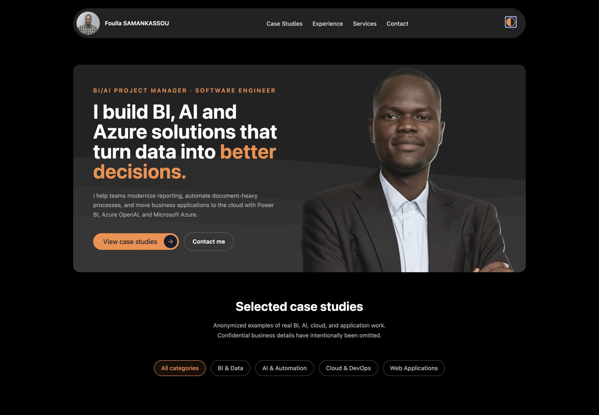
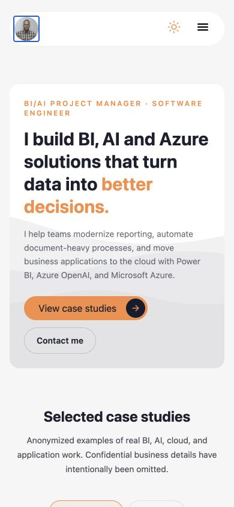
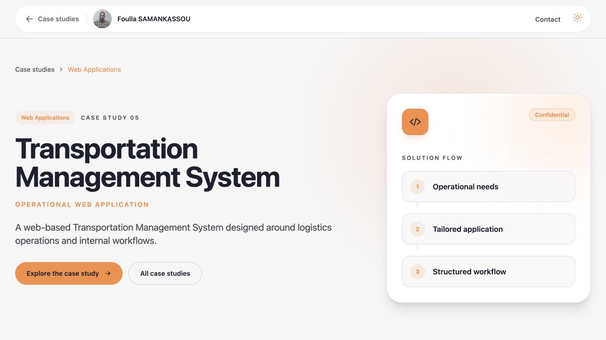

# Foulla SAMANKASSOU — Portfolio

Professional portfolio for a BI/AI Project Manager and Software Engineer specializing in Power BI, Azure OpenAI, cloud migration, automation, and application modernization.

[](https://nextjs.org/)
[](https://react.dev/)
[](https://www.typescriptlang.org/)
[](https://tailwindcss.com/)

**Live website:** [https://www.samankassou.com/](https://www.samankassou.com/)

## Preview



<table>
  <tr>
    <td width="64%">
      
    </td>
    <td width="36%" align="center">
      
    </td>
  </tr>
  <tr>
    <td align="center"><strong>Dark mode</strong></td>
    <td align="center"><strong>Mobile layout</strong></td>
  </tr>
</table>

### Case study experience



## What the portfolio includes

- A focused BI, AI, Azure, and software-engineering positioning.
- Five anonymized case studies based on real professional experience.
- Category filtering for BI & Data, AI & Automation, Cloud & DevOps, and Web Applications.
- Dedicated case-study pages with a conceptual solution flow, role, stack, challenge, approach, outcome, and confidentiality notice.
- Professional experience, services, certifications, testimonials, education, and contact sections.
- Responsive desktop, tablet, and mobile layouts.
- Persistent light, dark, and system theme support.
- Accessible navigation, semantic HTML, keyboard focus states, and reduced-motion support.
- SEO metadata, sitemap, robots configuration, Open Graph image, and Person structured data.
- MDX blog routes available at `/blog`, kept separate from the primary homepage journey.
- Contact form delivery through Resend, with validation, a honeypot, and basic rate limiting.

## Technology stack

| Area      | Technologies                          |
| --------- | ------------------------------------- |
| Framework | Next.js 16.3, React 19, App Router    |
| Language  | TypeScript 5.9                        |
| Styling   | Tailwind CSS 3.4                      |
| Motion    | Framer Motion 12                      |
| Icons     | React Icons                           |
| Content   | Typed TypeScript data files and MDX   |
| Email     | Resend                                |
| Quality   | ESLint, Prettier, TypeScript compiler |

## Getting started

### Requirements

- Node.js 20 or later
- npm

### Installation

```bash
git clone <repository-url>
cd portfolio
npm install
cp .env.example .env.local
npm run dev
```

Open [http://localhost:3000](http://localhost:3000).

The portfolio can run without Resend credentials, but the contact form requires the variables described below.

## Environment variables

Create `.env.local` from `.env.example`:

```env
RESEND_API_KEY=
CONTACT_EMAIL=
RESEND_FROM_EMAIL="Portfolio Contact <portfolio@samankassou.com>"
```

| Variable            | Purpose                                            |
| ------------------- | -------------------------------------------------- |
| `RESEND_API_KEY`    | Server-side API key used to send contact messages. |
| `CONTACT_EMAIL`     | Inbox that receives portfolio enquiries.           |
| `RESEND_FROM_EMAIL` | Verified sender identity configured in Resend.     |

Never commit `.env.local` or a real API key. See [RESEND_SETUP.md](./RESEND_SETUP.md) for the complete setup and production checklist.

## Available commands

```bash
npm run dev         # Start the development server
npm run build       # Create a production build
npm start           # Start the production server
npm run lint        # Run ESLint with zero warnings allowed
npm run type-check  # Validate TypeScript without emitting files
```

Format changed files with:

```bash
npx prettier --write <files>
```

## Project structure

```text
portfolio/
├── app/
│   ├── api/contact/            # Contact form API route
│   ├── blog/                   # Blog index and MDX post routes
│   ├── components/
│   │   ├── layout/             # Navigation, sidebars, footer
│   │   ├── providers/          # Theme and seasonal providers
│   │   ├── sections/           # Homepage sections
│   │   └── ui/                 # Reusable UI primitives
│   ├── portfolio/[id]/         # Dynamic case-study pages
│   ├── layout.tsx              # Metadata, schema, providers
│   ├── opengraph-image.tsx     # Generated social preview
│   ├── page.tsx                # Homepage composition
│   ├── robots.ts               # Search-engine rules
│   └── sitemap.ts              # Generated sitemap
├── content/blog/               # MDX articles
├── lib/
│   ├── components/             # Shared icon component
│   ├── constants/              # Theme and color constants
│   ├── data/                   # Typed portfolio content
│   ├── hooks/                  # Scroll animation hook
│   ├── types/                  # Shared TypeScript interfaces
│   └── utils/                  # Animation and MDX utilities
├── public/img/                 # Profile and hero assets
├── screenshots/                # README screenshots
├── BLOG_SETUP.md               # Blog authoring guide
├── RESEND_SETUP.md             # Contact form setup guide
└── package.json
```

## Content architecture

The application separates content from presentation:

1. `lib/types/index.ts` defines the content contracts.
2. `lib/data/*.ts` stores typed portfolio content.
3. Components render the data without embedding professional claims in the UI layer.

This makes most content changes possible without editing layout components.

### Main content files

| File                         | Content                                           |
| ---------------------------- | ------------------------------------------------- |
| `lib/data/siteConfig.ts`     | Metadata, author identity, social links           |
| `lib/data/profile.ts`        | Profile, skills, and contact information          |
| `lib/data/projects.ts`       | Case studies, categories, roles, and technologies |
| `lib/data/experience.ts`     | Professional experience                           |
| `lib/data/services.ts`       | Service offering                                  |
| `lib/data/certifications.ts` | Certifications and verification links             |
| `lib/data/testimonials.ts`   | Testimonials                                      |
| `lib/data/education.ts`      | Education                                         |
| `content/blog/*.mdx`         | Blog articles                                     |

## Adding or editing a case study

Case studies live in `lib/data/projects.ts` and follow the `Project` interface from `lib/types/index.ts`.

```typescript
{
  id: 6,
  title: "Project title",
  link: "Short project type",
  category: "AI & Automation",
  description: "Concise overview of the business need.",
  technologies: ["Azure OpenAI", "Power Platform"],
  role: "Project role",
  confidentialityNote: "Anonymized case study — details are confidential.",
  challenge: "The situation or constraint.",
  solution: "The approach and responsibilities.",
  results: "A factual outcome without unsupported metrics.",
}
```

Supported categories are:

- `BI & Data`
- `AI & Automation`
- `Cloud & DevOps`
- `Web Applications`

Every case-study page automatically adapts its icon and conceptual solution flow to the selected category. Keep confidential details anonymized and avoid adding metrics that cannot be verified.

## Blog authoring

Blog posts are stored as MDX files in `content/blog/`. Each file requires frontmatter for the title, excerpt, date, category, image, tags, author, and featured status.

See [BLOG_SETUP.md](./BLOG_SETUP.md) for the authoring format and supported features.

## Contact form

The form posts to `app/api/contact/route.ts`. The server route validates and limits input, rejects the honeypot field, escapes user content, and sends the resulting email through Resend.

For production:

1. Verify the sending domain in Resend.
2. Configure the three environment variables on the hosting platform.
3. Replace the in-memory rate limiter with a shared store when deploying across multiple instances at scale.

## SEO and social sharing

The portfolio includes:

- Page-level metadata for the homepage, blog posts, and case studies.
- A generated 1200 × 630 Open Graph image.
- Canonical homepage metadata.
- `Person` JSON-LD structured data.
- Generated `/sitemap.xml` and `/robots.txt` routes.

Update the production URL and author metadata in `lib/data/siteConfig.ts` if the domain changes.

## Deployment

The project is compatible with Vercel and any Node.js host that supports Next.js.

```bash
npm run build
npm start
```

Before deploying, verify:

- `npm run type-check`
- `npm run lint`
- `npm run build`
- Resend environment variables
- Domain verification and canonical URL
- Case-study wording and confidentiality requirements

## Additional documentation

- [Contact form and Resend setup](./RESEND_SETUP.md)
- [MDX blog authoring](./BLOG_SETUP.md)

## Author

**Foulla SAMANKASSOU**<br>
BI/AI Project Manager · Software Engineer<br>
[LinkedIn](https://linkedin.com/in/sam-foulla) · [GitHub](https://github.com/samankassou) · [Portfolio](https://www.samankassou.com/)
